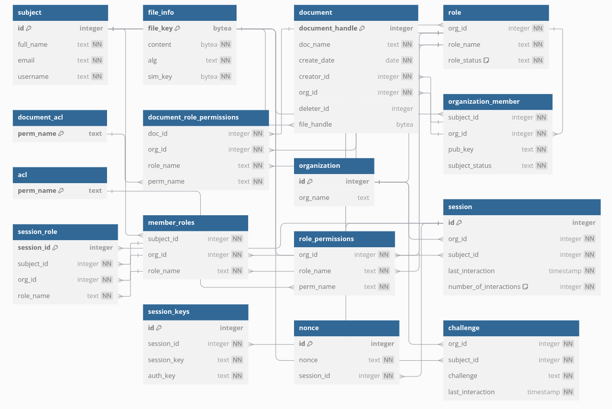

# Group members
- Rodrigo Abreu, 113626
- Eduardo Lopes, 103070
- Raquel Vinagre, 113736


## Features
- Assume role
- Drop role
- List roles
- List role subjects
- List subject roles
- List role permissions
- List permission roles
- Add role
- Suspend role
- Reactivate role
- Add permission (add role to a subject)
- Remove permission (remove role from a subject)
- Add permission (add permission to a role)
- Remove permission (remove permission from a role)
- Change ACL of a doc


## Notes 
The repository's asymmetric keys are stored in a .env file. 
To start up the repository, the password is **sio**.
We implemented a relational SQLLite database to store the necessary data in a peristent and organized way.

The command rep_add_subject, in the input **credentials file** we use the new subject's public key 

In the command rep_create_session, the **session file** it's the directory plus the base name filename to store the sesion data. The command automatic adds the username and the organization id to the name (ex. "session/sessionFile.json" -> "session/sessionFile_user1_1.json"). Also, the **organization** input is the organization id.

Regarding assuming/dropping roles, we assume that a subject can only have one active role at a time. To take on a new role, the subject must first drop the old one. 

The db schema is provided in the file: schema.sql
To initialize the db, you should run the following command:

```bash
python3 init_db.py
```

Run the repository:
```bash
python3 repository.py
```

## Communication Notes
The encryption of communications with the repository was implemented using a hybrid cipher. A 32-byte symmetric key was generated and used to encrypt the payload sent to the repository. Subsequently, the MAC (Message Authentication Code) of the encrypted content was calculated using another 32-byte key. Finally, everything was encrypted with the recipient's public key (either the repository's or the session's public key).

The payload also includes the encrypted nonce (calculated during the encryption process) to ensure the uniqueness of the message, as well as the sequence number to guarantee the order of the messages.

#### new comunication security

The commands that use the anonymous API, now are encrypted using the algorithm above discribed.

The commands that use the authenticated API and authorized API sign the encrypted message with the session's private key (when sending to the repository). The repository verifies the signature (with the session's public key) and also signs the response with its key. The subject verifies the signature of the response as soon as the message occurs (authenticity).

When creating a session, fisrt the subject has to request a challenge. The challenge is a random number (os.random(32)) and its sended to the suject encrypted with the subject's public key (for that organization). To respond, the subject decyptes the challenge and sends it back, but this time encrypted with the repository's public key. To finalize, the repository compares the random number received with the one previous generated. If it checks, a authentication key is generated for that session. This key is signed with the repository's private key and sent to the subject to be stored in the session file. This way, every time the session communicates with the repository, it only needs to send the signature stored in the session file. The repository verifies the signature using it's public key and the authentication key stored in the DB.

## DB Diagram



## Commands implemented
##### 1.
```bash
rep_assume_role <session file> <role>
```
This command activates a role in the organization provided on the session file. The role is stored in the session_role table in the db.

##### 2. 
```bash
rep_drop_role <session file> <role>
```
This command deactivates a role in the organization provided on the session file. The role is removed from the session_role table in the db.

##### 3. 
```bash
rep_list_roles <session file> <role>
```
Lists all roles of the organization provided on the session file.

##### 4. 
```bash
rep_list_role_subjects <session file> <role>
```
Lists all existing subjects with the role provided on the organization provided on the session file.

##### 5.
```bash
rep_list_subject_roles <session file> <username>
```
Lists all roles of the subject provided on the organization provided on the session file.

##### 6.
```bash
rep_list_role_permissions <session file> <role>
```
Lists all permissions of the role provided on the organization provided on the session file.

##### 7.
```bash
rep_list_permission_roles <session file> <permission>
```
Lists all roles with the permission provided on the organization provided on the session file.

##### 8.
```bash
rep_add_role <session file> <role>
```
Adds a new role to the organization provided on the session file. The role is stored in the role table in the db.

##### 9.
```bash
rep_suspend_role <session file> <role>
```
Suspends a role in the organization provided on the session file. All other sessions drop the active role (if the session's active role is equal to the one that was suspended)

##### 10.
```bash
rep_reactivate_role <session file> <role>
```
Reactivates a role in the organization provided on the session file.

##### 11.
```bash
rep_add_permission <session file> <role> <username>
```
This command adds a role to a subject in the organization provided on the session file. The role is stored in the session_role table in the db.
 
##### 12.
```bash
rep_remove_permission <session file> <role> <username>

```
This command removes a role from a subject in the organization provided on the session file. The role is removed from the session_role table in the db.

#### 13.
```bash
rep_add_permission <session file> <role> <permission>
```
Adds a permission to a role in the organization provided on the session file. The permission is stored in the role_permissions table in the db.

#### 14.
```bash
rep_remove_permission <session file> <role> <permission>
```
Removes a permission from a role in the organization provided on the session file. The permission is removed from the role_permissions table in the db.

#### 15.
```bash
rep_acl_doc <session file> <document name> [+/-] <role> <permission> 
```
Changes the ACL of a document in the organization provided on the session file. The permission is stored in the doc_permissions table in the db.

#### Testing

## Testing all the commands

We can use the following commands to test the implementions.

### 1. Assume role
```bash
./rep_assume_role "session/sessionFile_user1_1.json" "manager"
```

### 2. Drop role
```bash
./rep_drop_role "session/sessionFile_user1_1.json" "manager"
```

### 3. List roles
```bash
./rep_list_roles "session/sessionFile_user1_1.json"
```

### 4. List role subjects
```bash
./rep_list_role_subjects "session/sessionFile_user1_1.json" "manager"
```

### 5. List subject roles
```bash
./rep_list_subject_roles "session/sessionFile_user1_1.json" "user1"
```

### 6. List role permissions
```bash
./rep_list_role_permissions "session/sessionFile_user1_1.json" "manager"
```

### 7. List permission roles
```bash
./rep_list_permission_roles "session/sessionFile_user1_1.json" "ROLE_MOD"
```

### 8. Add role
```bash
./rep_add_role "session/sessionFile_user1_1.json" "role1"
```

### 9. Suspend role
```bash
./rep_suspend_role "session/sessionFile_user1_1.json" "role1"
```

### 10. Reactivate role
```bash
./rep_reactivate_role "session/sessionFile_user1_1.json" "role1"
```

### 11. Add permission (add role to a subject)
```bash
./rep_add_permission "session/sessionFile_user1_1.json" "role1" "user1"
```

### 12. Remove permission (remove role from a subject)
```bash
./rep_remove_permission "session/sessionFile_user1_1.json" "role1" "user1"
```

### 13. Add permission (add permission to a role)
```bash
./rep_add_permission "session/sessionFile_user1_1.json" "role1" "ROLE_NEW"
```

### 14. Remove permission (remove permission from a role)
```bash
./rep_remove_permission "session/sessionFile_user1_1.json" "role1" "ROLE_NEW"
```

### 15. Change ACL of a doc
```bash
./rep_acl_doc "session/sessionFile_user1_1.json" "doc1" "+" "role1" "DOC_ACL"
```
